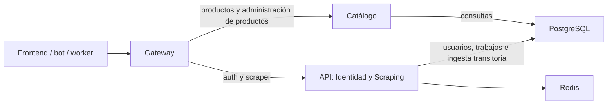

# SUP-268: enrutamiento y despliegue independiente de Catálogo

La rama `backend/refactor/sup-268-enrutar-desplegar-catalogo-vmatus` parte del
merge de SUP-267 en `develop-refactor`, `1ae1f86`. Esta etapa activa el proceso
extraído; no traslada todavía la escritura de ingesta ni modifica tablas.

## Flujo y rutas



| Ruta | Destino |
|---|---|
| `/api/v1/productos` y subrutas | Catálogo |
| `/api/v1/admin/productos` y subrutas | Catálogo |
| `/api/v1/auth/*`, `/api/v1/scraper/*` | API |
| `/`, `/health`, `/api/v1/health`, `/swagger/*` y otras rutas | API |
| `/_gateway/live`, `/_gateway/ready`, `/_gateway/dependencies` | Gateway |

El enrutamiento comprueba el segmento completo: `productos-falso` no coincide.
Todos los métodos van al propietario de la ruta, que aplica permisos, CORS y
405. Se conservan path codificado, query, cuerpo, cookies, Host e ID de petición.
Catálogo verifica JWT y rol directamente. La Gateway no confía en
`X-User-ID`, `X-Role` ni `X-User-Role`.

`CATALOGO_URL` configura el origen interno, sin credenciales, prefijo, query ni
fragmento; en Compose es `http://catalogo:8080`. `BACKEND_URL` conserva la API.
Una caída de Catálogo produce `catalogo_unavailable` (502) o `catalogo_timeout`
(504), sin consultar la API como fallback. Los errores equivalentes de API
conservan `backend_unavailable`/`backend_timeout`. Se mantienen límites de tiempo,
cancelación, sanitización de cabeceras y ausencia de reintentos de escrituras.

## Salud y aislamiento de fallos

`/_gateway/ready` comprueba el proceso/router configurado, igual que liveness.
No consulta los servicios. Si Redis o la API fallan, retirar todas las réplicas
de Gateway del Service también impediría consultar un Catálogo sano.

`/_gateway/dependencies` es el diagnóstico agregado: consulta en paralelo
`/api/v1/health` de API y `/_catalogo/ready` de Catálogo, con el límite común
`GATEWAY_READINESS_TIMEOUT` (2 s). Responde 503 si alguno falla; publica
`backend`, `database`, `redis`, `catalogo` y `catalogo_database`. Debe vigilarse
junto a errores 502/504, no configurarse como readiness probe de Gateway.

Catálogo tiene readiness PostgreSQL y liveness independiente. Sus pods pueden
salir del Service `catalogo` cuando falla su dependencia, sin retirar Gateway.
PostgreSQL sigue compartido y puede afectar a ambos dominios.

## Compose

El Compose principal incorpora `catalogo` sin puerto publicado ni nombre de
contenedor fijo, para permitir varias réplicas. API mantiene el puerto 8080
para depuración, limitado a loopback; la entrada pública local es Gateway en
8082 y el frontend en 3000. Los clientes internos conservan `api:8080`.
Los clientes que antes consultaban productos directamente en 8080 deben pasar
a la entrada Gateway antes del corte.

El `depends_on` de Compose espera API y Catálogo sanos al levantar el conjunto
por primera vez. El aislamiento de fallos comprobado corresponde a servicios ya
arrancados; los Deployments Kubernetes no tienen esa dependencia de arranque.

Configurar `CATALOGO_CORS_ALLOWED_ORIGINS` con los orígenes exactos del frontend.
Los valores predeterminados permiten sólo `http://localhost:3000` y
`http://localhost:5173`; otro hostname, puerto o esquema requiere entrada propia.
Se mantienen las restricciones y errores públicos seguros incorporados en SUP-267.

```bash
docker compose up -d --build db redis go_service catalogo gateway frontend
docker compose up -d --no-deps --scale catalogo=3 catalogo
```

Catálogo requiere sólo PostgreSQL y la clave JWT del emisor; no tiene Redis.
Las credenciales de DB del Compose principal y los manifiestos compartidos
siguen siendo las actuales hasta SUP-271. La prueba aislada utiliza un rol
lector de sólo cuatro tablas; no provisiona roles en la base del equipo.

## Kubernetes y HPA

`infrastructure/k8s/catalogo/` define ConfigMap, Deployment, Service ClusterIP
y HPA propios. No se añade un Ingress para Catálogo. Gateway mantiene el Service
público `api`; el Service `api-backend` conserva Identidad/Scraping.

| Configuración de Catálogo | Valor inicial |
|---|---|
| Réplicas | 1; HPA entre 1 y 4 |
| Request CPU / límite CPU | 100m / 500m por pod |
| Request memoria / límite memoria | 64Mi / 256Mi por pod |
| Métrica HPA | CPU al 70% del request, aproximadamente 70m por pod |
| Estabilización aumento / reducción | 30 s / 300 s |
| Máximo de conexiones PostgreSQL | 10 por proceso; hasta 40 con cuatro réplicas |

Estos valores son un punto de partida y deben ajustarse con carga real y el
presupuesto PostgreSQL, incluyendo conexiones de API y otros consumidores.
CPU puede no reflejar saturación de consultas SQL. El HPA necesita Metrics Server
y capacidad de nodos. La prueba Compose demuestra procesos independientes y
lecturas concurrentes; no demuestra una actuación real del HPA del clúster.
El HPA existente de API permanece independiente para sus propias rutas.

## Orden de activación en el clúster de prueba

Usar el namespace real y fijar las tres imágenes a tags SHA o digests verificados.
Los manifiestos apuntan a `develop-refactor` como referencia de integración;
no aplicar toda la carpeta recursivamente. La activación la realiza el equipo:

1. Registrar selector del Service público, imágenes actuales y una imagen de
   API anterior a SUP-268 que todavía contenga el lector. Conservar su digest
   como referencia de rollback; no volver a descargar un tag mutable distinto.
2. Configurar los orígenes reales en `catalogo/configmap.yaml`, el mismo
   `JWT_SECRET` del emisor y las credenciales existentes. Aplicar ConfigMap,
   Service y Deployment de Catálogo; esperar su rollout y readiness. Comprobar
   lectura y rechazo de visitantes/usuarios registrados en administración.
3. Aplicar Gateway con `CATALOGO_URL`, conservando la API anterior. Esperar su
   rollout, comprobar dependencias y probar productos/login/scraping por el
   Service público y frontend. Si aún no se hizo el corte de SUP-265, mover el
   selector de `api` a Gateway sólo después de estas verificaciones.
4. Actualizar la API a la imagen de SUP-268 sin lector. La Gateway ya debe
   enviar las consultas de productos a Catálogo. Repetir las pruebas y comprobar
   que la API directa responde 404 a consultas de productos.
5. Aplicar HPA de Catálogo. Verificar métricas, realizar carga controlada de
   lecturas y registrar réplicas de Catálogo/API, latencias y conexiones DB.
   La carga de productos debe poder aumentar Catálogo sin replicar Identidad.

No ejecutar escrituras de fixtures ni spiders contra una base compartida para
validar este cambio. El humo del repositorio utiliza recursos aislados.

## Rollback

Vaciar `CATALOGO_URL` por sí solo no funciona con la API actual: ya no contiene
el lector. Restaurar primero una imagen de API anterior a SUP-268 y después
cambiar Gateway a modo legado; no borrar volúmenes ni migrar datos.

En Compose, mantener proyecto y `.env`, y fijar una imagen verificada:

```bash
export SUP268_LEGACY_API_IMAGE='<imagen-pre-SUP268-verificada>'
docker compose -f docker-compose.yml -f docker-compose.catalogo-rollback.yml up -d --wait go_service gateway
docker compose -f docker-compose.yml -f docker-compose.catalogo-rollback.yml up -d --no-deps --force-recreate --wait frontend
docker compose stop catalogo
```

El alias público permanece en Gateway; Nginx se recrea porque puede mantener una
IP de Gateway anterior. El override antiguo `docker-compose.gateway-rollback.yml`
permite retirar también Gateway, pero ahora exige la misma imagen anterior de
API. Para volver a activar Catálogo, retirar el override, reconstruir/seleccionar
la API de SUP-268 y recrear Gateway y los clientes que hayan fijado su IP.

En Kubernetes: restaurar la imagen anterior de API, esperar rollout y verificar
sus lecturas; después quitar `CATALOGO_URL` de Gateway y esperar su rollout.
Comprobar productos y administración por el Service público antes de reducir
Catálogo. El HPA puede restaurar réplicas: retirarlo antes de escalar su
Deployment a cero. No cambiar el selector público a una API sin lector.

## Pruebas y limpieza

```bash
bash scripts/smoke_catalogo_routing_compose.sh
```

El script aplica el Compose principal con override aislado, copia la API anterior
desde el merge fijo `1ae1f8662e1d0fa972b04700ec7a84c9e037565c` usando `git archive`,
y crea DB, credenciales, red y volumen propios. CI descarga el historial para
tener esa referencia disponible. `SUP268_REFERENCE_REF` permite seleccionar
otra referencia compatible; no debe apuntar a una API sin lector.

Comprueba contratos frente a la referencia, frontend/Nginx/Gateway/Catálogo,
login real y roles, registro/perfil sin escalada, trabajos/Redis e ingesta visible
en Catálogo. Escala Catálogo a tres procesos y conserva los IDs de API/Gateway;
ejecuta 120 lecturas con 24 clientes concurrentes y cuenta los procesos que las
sirvieron mediante logs correlacionados. La distribución observada depende de
DNS y conexiones persistentes; no representa capacidad garantizada.

Luego detiene Catálogo y verifica Identidad operativa, detiene API/Redis y
verifica Catálogo público/administrativo operativo con una sesión existente,
y prueba rollback con Catálogo detenido. Reutiliza una cookie real en archivo
temporal privado para respetar el límite de intentos de login; no desactiva
autenticación ni rate limiting. No inicia bot, worker ni scraping externo.
El cleanup elimina sólo los recursos y la CA temporal de esa ejecución.

`SUP268_SKIP_BUILD=1` reutiliza imágenes locales comprobadas; los puertos de
prueba se pueden configurar con `SUP268_API_PORT`, `SUP268_GATEWAY_PORT`,
`SUP268_FRONTEND_PORT` y `SUP268_REFERENCE_PORT`. El comando anterior
`scripts/smoke_gateway_compose.sh` delega en este humo.

Se eliminan los paquetes de consulta antiguos y sus pruebas duplicadas en API;
las pruebas originales de productos permanecen en Catálogo. Los modelos ORM
usados por el sembrador y la ingesta transitoria se conservan. El Swagger público
actual se mantiene como documento agregado servido por API detrás de Gateway;
regenerarlo desde API únicamente eliminaría las rutas de Catálogo. Una futura
regeneración debe incorporar las anotaciones de ambos módulos.

La siguiente tarea, SUP-269, trasladará las escrituras de productos y capturas
a Catálogo. SUP-270/SUP-271 cubrirán recuperación, propiedad de datos y permisos.

## Comprobaciones realizadas

- 132 resultados Go de Gateway y 65 de API aprobados, incluyendo subpruebas,
  con detector de carreras; vet y compilación aprobados en ambos módulos.
- Imágenes runtime de API/Gateway construidas; Catálogo y frontend utilizan
  las imágenes locales ya comprobadas de sus implementaciones sin cambios.
- 203 comprobaciones del humo de enrutamiento aprobadas: 40 contratos y
  restricciones CORS, 27 de composición/ingesta/frontend, 120 lecturas de carga,
  4 con Catálogo detenido, 6 con API/Redis detenidos y 6 de rollback.
- Tres procesos de Catálogo sirvieron la carga observada; API y Gateway
  conservaron una réplica y sus mismos IDs durante el escalado.
- Humo independiente de Catálogo aprobado con API archivada: 40 contratos,
  5 comprobaciones sin API/Redis y 3 con PostgreSQL detenido.
- 11 recursos Kubernetes válidos con kubeconform estricto para Kubernetes 1.32;
  workflows validados con actionlint y scripts con comprobación de sintaxis.

Las pruebas se ejecutaron localmente en recursos aislados, eliminados al terminar.
No se desplegó en el clúster, no se comprobó allí la actuación del HPA y no se
publicaron imágenes. Los cambios de SUP-268 permanecen sin commit ni push hasta
la revisión y autorización del autor.
