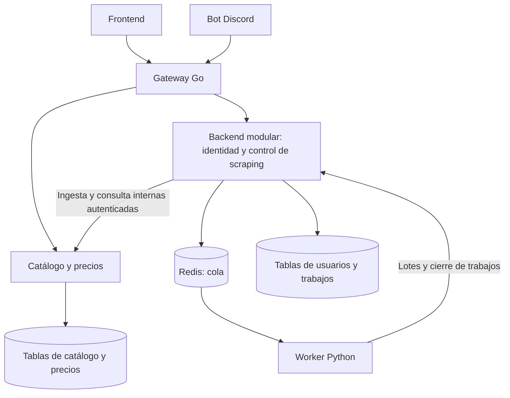

# Refactorización del backend: alcance, arquitectura y migración

**Estado:** diseño propuesto; todavía no se ha implementado la extracción.
**Base inspeccionada:** `develop`, commit `5db3d25`.
**Rama de integración:** `develop-refactor`.
**Responsable:** Vicente Sebastian Matus Mora (`vmatus`), con implementación asistida y revisión del equipo.

## 1. Decisión de alcance

El problema observado es que las consultas de catálogo replican el mismo ejecutable que contiene identidad y scraping. El objetivo inicial es escalar catálogo independientemente, conservar contratos públicos y limitar el costo operativo para un equipo pequeño.

**Primer resultado:** Gateway transparente + Catálogo independiente + backend existente organizado como monolito modular para identidad y coordinación de scraping. No se extraerán esos dos dominios automáticamente. Una arquitectura con Gateway, Identidad, Catálogo y Control de scraping separados sigue siendo una opción posterior, condicionada a evidencia y a una decisión del equipo.

La separación de paquetes dentro de un binario sirve para organizar el código, pero no permite escalar catálogo solo. La extracción de catálogo sí permite ese despliegue independiente. La Gateway y PostgreSQL seguirán recibiendo carga y pueden necesitar recursos adicionales; ninguna etapa promete eliminar sus cuellos de botella.

## 2. Arquitectura del primer resultado



Los grupos de datos pueden residir en el mismo PostgreSQL. La separación inicial es de propiedad, permisos y acceso, no de servidores físicos.

```text
backend/
├── api/                         # Backend existente durante la migración
│   ├── cmd/backend/main.go      # Entrada propuesta al modularizar
│   └── internal/
│       ├── identidad/           # Handlers, servicios y repositorios de usuarios
│       ├── scraping/            # Trabajos, estados, cola y cliente de catálogo
│       └── platform/            # Configuración y utilidades técnicas limitadas
├── gateway/                     # Nuevo proxy, sin repositorios de negocio
│   ├── cmd/gateway/main.go
│   ├── internal/config/
│   ├── internal/proxy/
│   ├── internal/middleware/
│   ├── go.mod
│   ├── go.sum
│   └── Dockerfile
├── catalogo/                    # Nuevo servicio de consultas e ingesta
│   ├── cmd/catalogo/main.go
│   ├── internal/
│   │   ├── handlers/
│   │   ├── services/
│   │   ├── repositories/
│   │   ├── domain/
│   │   ├── infrastructure/
│   │   ├── middleware/
│   │   └── config/
│   ├── tests/
│   ├── go.mod
│   ├── go.sum
│   └── Dockerfile
├── scraper/                     # Worker Python existente
├── bot_discord/                 # Cliente existente
├── ia_conversacional/           # Fuera de esta extracción
└── motor_rutas/                 # Fuera de esta extracción
```

`internal` impide importaciones desde fuera del módulo, pero no impide todas las dependencias entre sus paquetes. Se añadirán comprobaciones de importaciones para que identidad y scraping no compartan repositorios o modelos de dominio. Cada módulo expondrá un contrato pequeño y explícito.

Gateway y Catálogo tendrán módulos Go, Dockerfiles e imágenes propias. No importarán lógica de negocio ni modelos GORM de `backend/api`. No se creará una biblioteca compartida que reúna los dominios. Los contratos HTTP se documentarán y comprobarán en pruebas.

### Rutas y propiedad de las decisiones

| Rutas públicas existentes | Destino inicial | Destino tras extracción de catálogo |
|---|---|---|
| `/api/v1/auth/*` | Backend actual | Módulo de identidad del backend |
| `/api/v1/productos` y `/api/v1/productos/*` | Backend actual | Catálogo |
| `/api/v1/admin/productos` y variantes existentes | Backend actual | Catálogo, con autorización administrativa |
| `/api/v1/scraper/trabajos*` | Backend actual | Módulo de scraping del backend |
| `/api/v1/scraper/productos` | Backend actual | Módulo de scraping; delega persistencia en catálogo |
| `/api/v1/scraper/trabajos/:id/productos` | Backend actual | Módulo de scraping; valida trabajo y delega persistencia |

La Gateway conserva método, path, query, cuerpo, códigos, cookies y headers pertinentes. Tendrá timeouts, límites de cuerpo, propagación de cancelación y errores definidos por destino. No reintentará escrituras automáticamente. Los endpoints internos de catálogo no tendrán rutas en el proxy público.

El módulo de scraping puede consultar cadenas y sucursales mediante un contrato interno de catálogo, sin leer sus tablas. El worker no recibe acceso a PostgreSQL.

## 3. Etapas ejecutables y tareas Scrum

Cada etapa incluye pruebas, actualización de Compose/CI/manifiestos y documentación. El clúster de prueba es una validación explícita: no se sustituye por pruebas locales ni se despliega automáticamente en el entorno universitario activo.

### RF-01 — Introducir Gateway transparente delante del backend

**Rama:** `backend/refactor/introducir-gateway-vmatus`.

**Implementación:**
1. Registrar respuestas y pruebas existentes antes de cambiar la entrada; inventariar rutas, cookies y errores.
2. Crear `backend/gateway` y configurar `BACKEND_URL`; todas las rutas de negocio siguen en el backend.
3. Conservar inicialmente las políticas de autenticación y rate limiting donde ya se ejecutan; no duplicar cobros de cuota o contadores.
4. Añadir Compose, imagen, CI de PR hacia `develop-refactor` y manifiestos de la Gateway.
5. Ejecutar humo directo al backend y a través del proxy, incluido registro/login, catálogo, administración y scraping simulado.

**Criterio de salida:** proxy compatible, sin conexión PostgreSQL, logs correlacionados y prueba de destino caído. El backend sigue ejecutando la misma lógica.

**Rollback:** volver a dirigir el Service/Ingress o el proxy local al backend anterior. No hay migración de datos en esta etapa. Ensayar el cambio de entrada con imágenes por commit.

### RF-02 — Modularizar el backend restante y extraer lectura de catálogo

**Rama:** `backend/refactor/extraer-catalogo-vmatus`.

**Implementación:**
1. Separar paquetes internos de identidad y scraping sin modificar sus contratos.
2. Crear `backend/catalogo`; mover handlers, servicio, repositorio y DTO/modelos necesarios de productos, incluido catálogo administrativo.
3. Mantener la emisión de JWT en el backend y configurar verificación en catálogo según la sección de seguridad.
4. Hacer que la Gateway enrute únicamente las rutas de productos/administración de productos a catálogo mediante configuración por grupo de rutas.
5. Crear el rol de lectura de catálogo y verificar respuestas sobre las tablas actuales, sin copiar ni renombrar datos.
6. Añadir imagen, Service, Deployment, probes y HPA propios; medir la extracción antes de aumentar réplicas.

**Criterio de salida:** Catálogo despliega y escala aparte, las pruebas de contrato de productos pasan y login/scraping siguen funcionando en el backend modular. Documentar que el backend continúa escribiendo productos durante esta transición.

**Rollback:** devolver esas rutas al backend de compatibilidad. Conservar temporalmente sus handlers de catálogo en la imagen de rollback; no eliminarlos hasta completar RF-04. Ambos lectores ven las mismas tablas.

### RF-03 — Transferir ingesta a catálogo y recuperar trabajos fallidos

**Rama:** `backend/refactor/transferir-ingesta-vmatus`.

**Implementación:**
1. Añadir los metadatos de ingesta, recibos idempotentes y registro durable de lotes descritos en la sección 6.
2. Actualizar worker y módulo de scraping para identificar observaciones/lotes; conservar las rutas públicas existentes.
3. Añadir endpoint interno autenticado de catálogo; mover allí validación y transacción de productos/precios.
4. Cambiar el escritor mediante configuración `INGESTA_DESTINO=legacy|catalogo`. Solo un modo escribe cada lote; no hacer doble escritura.
5. Implementar confirmación/reconciliación del resultado, outbox de trabajos y cola recuperable de la sección 7.
6. Validar reenvío tras timeout, caída de catálogo, caída del worker y error entre confirmación de catálogo y actualización del trabajo.

**Criterio de salida:** no se duplican observaciones por reintentos, no se marca completado un trabajo con lotes pendientes y no se pierden silenciosamente trabajos. Identificar cualquier diferencia funcional previa y revisarla como cambio separado.

**Rollback:** detener nuevas ejecuciones, drenar/reconciliar pendientes y volver a la última versión de compatibilidad que entiende los recibos de lotes. No volver a un escritor antiguo que ignore idempotencia. Mantener columnas/tablas añadidas; no borrar capturas confirmadas.

### RF-04 — Cerrar permisos, validar carga y consolidar el primer resultado

**Rama:** `backend/refactor/consolidar-catalogo-vmatus`.

**Implementación:**
1. Aplicar propiedad/permisos finales de la sección 4 y reemplazar lecturas cruzadas por el cliente interno de catálogo.
2. Retirar del backend los handlers/repositories activos de catálogo y dependencias ya innecesarias, manteniendo una imagen de rollback compatible.
3. Ajustar observabilidad, recursos y HPA con los resultados de carga y cuotas del clúster.
4. Probar local, migración sobre copia de datos y despliegue en el clúster de prueba; verificar pérdida de dependencias y recuperación.
5. Documentar costo operativo y decidir con el equipo si se justifica otra extracción.

**Criterio de salida:** Gateway + Catálogo + backend modular funcionan con contratos compatibles; cada componente usa permisos propios. Catálogo puede replicarse sin replicar identidad/scraping por estar en el mismo ejecutable. La evidencia incluye RPS, p95, errores, réplicas, recursos y conexiones PostgreSQL.

**Rollback:** restaurar configuración/imágenes compatibles anteriores y permisos de la versión de compatibilidad mediante procedimiento versionado. Los datos nuevos permanecen. Si se requiere recuperar backup, reconocer explícitamente su RPO y escrituras posteriores; no presentar una restauración como reversible sin pérdida.

**Salida:** PR `develop-refactor` → `develop` para el primer incremento. Promoción a producción separada.

### RF-05 — Extraer identidad solo si hay una razón medida

**Rama, si se aprueba:** `backend/refactor/extraer-identidad-vmatus`.

**Condición de entrada:** costo de escalado del backend, necesidad de despliegue/autonomía, aislamiento de fallos o requisitos de seguridad que justifiquen otro servicio. No basta con que exista una carpeta.

Mover el módulo de identidad a proceso propio, conservar login/perfil/cookies, introducir `IDENTIDAD_URL` en la Gateway y separar propiedad de usuarios. El diseño de firma/verificación y planes se mantiene. Probar sesiones emitidas antes del cambio.

**Criterio de salida:** identidad es autónoma, no rompe permisos de catálogo y cada servicio comprueba sus autorizaciones.

**Rollback:** volver a enrutar autenticación al módulo de compatibilidad; preservar usuarios y claves de verificación para los tokens aún vigentes.

### RF-06 — Extraer control de scraping solo si se justifica

**Rama, si se aprueba:** `backend/refactor/extraer-control-scraping-vmatus`.

**Dependencia:** ingesta de catálogo estable y decisión positiva de extracción. Si se decide separar ambos dominios, identidad precede a control de scraping por ser más aislada.

Mover trabajos, outbox, cola, recuperación y cliente de catálogo a proceso propio. Conservar endpoints de bot/worker y aplicar el plan de referencias entre propietarios. Los workers siguen siendo procesos independientes.

**Criterio de salida:** flujo completo y recuperación funcionan, trabajos y usuarios tienen propietarios separados y no hay acceso SQL cruzado desde el servicio nuevo.

**Rollback:** pausar productores y consumidores, reconciliar pendientes y volver al coordinador de compatibilidad. No consumir la misma cola con dos protocolos incompatibles.

```text
RF-01 Gateway → RF-02 Catálogo → RF-03 Ingesta fiable → RF-04 Consolidación
                                                           ↓
                                                Decisión del equipo
                                                           ↓
                                     RF-05 Identidad → RF-06 Control de scraping
```

Cada etapa puede tener varios PR pequeños y ejecutables. Su título Scrum debe describir la extracción/transformación; pruebas, seguridad y rollback son parte de su aceptación.

## 4. Partición de datos y permisos

### Propietarios y credenciales

| Actor | Permisos de aplicación propuestos |
|---|---|
| Gateway | Ninguna credencial PostgreSQL; Redis limitado a contadores si aplica rate limiting |
| Catálogo | Lectura de tablas propias desde RF-02; escritura desde RF-03 de productos, capturas, cadenas/sucursales y recibos de ingesta |
| Backend modular | Usuarios y trabajos/outbox/lotes pendientes; acceso temporal de escritor de catálogo solo hasta el corte |
| Worker/bot | Sin credencial PostgreSQL |
| Rol de migración | DDL y grants mediante ejecución controlada; no disponible a procesos de aplicación |

Roles propuestos: `app_catalogo`, `app_backend` y `migrador_backend`. Contraseñas mediante Secrets del despliegue; nunca en Git. Revocar permisos generales heredados cuando sea necesario; conceder `USAGE` del esquema, operaciones sobre tablas y permisos de secuencias explícitos. Probar operaciones permitidas y denegadas con cada rol.

Catálogo posee `scraper.productos_crudos`, `scraper.capturas_precios`, cadenas y sucursales. El backend posee `api.usuarios` y `scraper.trabajos_scraper` durante el primer incremento. Que un esquema se llame `scraper` no convierte todas sus tablas en propiedad del coordinador.

### Cómo se migran los datos

1. Inventariar tablas, referencias, índices, volúmenes y todos los escritores. Tomar backup y ensayar restauración sobre una copia; no ejecutar esto directamente en producción.
2. Usar migraciones versionadas e idempotentes para roles, metadatos y tablas auxiliares. No depender de `docker-entrypoint-initdb.d`, que solo inicializa bases nuevas.
3. Mantener tablas, IDs y secuencias actuales: extraer procesos no exige copiar datos. Si se añade metadata, hacer backfill por lotes con comprobaciones de conteo, nulos y unicidad.
4. Desplegar lectores compatibles, pausar nuevas ingestas para el corte de escritor, drenar/reconciliar pendientes y activar el nuevo escritor. Verificar conteos, muestras, precios e historial; después restringir permisos del escritor anterior.
5. Aplicar cambios destructivos solo en una fase posterior a la ventana de compatibilidad, con backup y rollback ensayados. No retirar columnas o constraints como parte del primer despliegue del nuevo servicio.

### Referencias entre dominios

Hoy `trabajos_scraper` tiene FK a cadenas y a `api.usuarios`. En el primer incremento usuarios y trabajos siguen en el mismo backend: conservar su FK. La referencia trabajo→cadena queda como dependencia compartida temporal; documentarla y restringir borrado de cadenas referenciadas antes de afirmar separación completa de datos.

Si se extrae control de scraping, mantener `usuario_id` como identificador externo opcional, derivarlo de un JWT verificado cuando corresponda y validar referencias por contrato. No confiar en un ID de usuario arbitrario del body. Retirar su FK cruzada solo tras definir anonimización/borrado con identidad y backfill de registros existentes. Validar cadena/sucursal mediante catálogo; usar identificadores estables y bajas lógicas para evitar referencias históricas huérfanas.

Las tablas de rutas tienen FK a usuarios, productos, sucursales y capturas. Permanecen fuera del alcance y se documentan como deuda de separación; no se moverán/borrarán tablas referenciadas para simular autonomía. La futura separación física requiere otra migración, no solo nuevos roles.

## 5. Seguridad y políticas de acceso

### Tokens de usuario

El módulo de identidad sigue emitiendo los JWT HS256 actuales durante la primera extracción. La Gateway comprueba tokens en rutas protegidas; catálogo vuelve a verificar firma, algoritmo permitido, vigencia y permisos para sus operaciones protegidas. Las rutas públicas conservan acceso anónimo según política. Nunca se confía en `X-User-ID` o `X-Role` proporcionados por clientes; la Gateway elimina headers internos reservados.

El secreto HS256 se inyecta mediante Secrets, sin fallback fijo en despliegues. Mientras se comparte, catálogo técnicamente también puede firmar tokens: es una limitación explícita. Si se extrae identidad o se exige aislamiento criptográfico, migrar a firma asimétrica con JWKS: identidad conserva clave privada y verificadores reciben solo claves públicas, con `kid`, cache y período de coexistencia de claves. Ese cambio necesita pruebas de compatibilidad y rotación; no introducirlo silenciosamente durante RF-02.

### Llamadas internas

El backend→catálogo usará TLS verificable y una credencial de servicio separada del JWT de usuarios, con alcance de ingesta/consulta interna. El worker→coordinador usará credencial propia. Desplegar primero los clientes que envían credenciales y habilitar su obligatoriedad en un corte coordinado, probado y documentado, sin perpetuar una ruta de escritura anónima. Montar secretos con nombres por cliente, rotación con coexistencia corta y comparación segura; no reenviar estas credenciales por la Gateway pública ni registrarlas en logs.

Separar endpoints públicos e internos por listener/puerto y Service; NetworkPolicy limita qué pods pueden acceder. Las credenciales siguen siendo obligatorias aunque un destino esté en ClusterIP. Localmente puede usarse loopback/red Docker aislada con configuración de desarrollo; nunca describir HTTP interno sin TLS como aislamiento criptográfico.

### Rate limiting, autorización y cuotas

| Política | Lugar de decisión |
|---|---|
| Límite técnico general por IP/usuario y tamaño de body | Gateway, con contador Redis compartido entre réplicas cuando sea necesario |
| Protección de login | Identidad/backend; conservar el límite actual y no incrementar dos veces por una solicitud |
| Acceso a operaciones administrativas | Servicio destino; Gateway puede rechazar temprano, pero no sustituye esa autorización |
| Límites funcionales de visitantes | Gateway puede aplicar políticas comunes; el servicio protege el endpoint y valida límites semánticos |
| Historial Premium | Catálogo valida el derecho; identidad/backend es fuente del plan |
| Cuota de uso de IA | Propietario de la cuota en identidad/entitlements y reserva/consumo por el servicio IA; no cobrar por cada salto del proxy |

Para visitantes, confiar en IP reenviada solo desde proxies configurados; definir política para caída de Redis. El login conserva el comportamiento actual fail-closed hasta que un cambio funcional sea aprobado. Nuevas políticas documentan por ruta si bloquean o permiten acceso degradado y sus códigos HTTP.

`rol` no equivale necesariamente a plan. Reservar un contrato interno de permisos con `user_id`, `plan`, `entitlements`, vigencia/version y un esquema documentado. No inventar Premium para usuarios existentes. Puede cachearse con TTL limitado; una operación premium usa verificación autoritativa cuando el estado cacheado no es aceptable. Si se añaden claims de plan, no tratar un JWT viejo como suscripción vigente indefinida. La implementación de monetización/cuotas nueva queda fuera de este refactor salvo comportamiento existente que deba preservarse.

## 6. Consistencia e idempotencia de ingesta

No hay transacción común entre estado del trabajo y precios. La solución inicial es entrega al menos una vez, recibos durables y reconciliación; no una transacción distribuida ni doble escritura.

### Identidad del lote y transacción

- El worker asigna `observacion_id` y `batch_id` estables y persiste el lote antes de enviarlo. El identificador del trabajo por sí solo no basta: un trabajo puede tener varios lotes.
- El coordinador valida el contexto del trabajo y registra payload, hash, `capturado_el`, identificador e intento de entrega en almacenamiento durable. Los campos externos existentes se conservan; metadata nueva se añade con compatibilidad documentada.
- El catálogo impone unicidad del identificador por fuente/observación. Misma clave y mismo hash devuelve el recibo anterior; misma clave y otro contenido devuelve conflicto.
- En una transacción PostgreSQL, catálogo valida todo el lote, aplica upsert de producto y captura, y guarda el recibo/respuesta. Un fallo revierte todo ese lote. Un conflicto de claves concurrentes se resuelve leyendo el recibo confirmado.
- El coordinador marca el lote confirmado solo tras recibir/verificar el recibo. Si cae después del commit de catálogo, reenvía con la misma clave o consulta el recibo interno y termina la confirmación.
- La selección de precio actual usa fecha de observación y orden determinista; un lote atrasado no sobreescribe el stock/precio actual de una observación más reciente. Reenviar no cambia `capturado_el` ni rejuvenece un precio.

El endpoint actual acepta resultados parciales por producto. Mantener ese contrato durante RF-01/RF-02. En RF-03, probar los clientes y acordar el comportamiento: el adaptador compatible puede dividir el lote en sublotes válidos, reportar errores originales y asociar claves estables a cada sublote. El protocolo interno es atómico por sublote; no prometer atomicidad de todo el trabajo ni cambiar silenciosamente respuestas de la API pública.

### Estados y caídas

Estados internos de entrega: `pendiente`, `enviando`, `reintentando`, `confirmado`, `rechazado`. El trabajo se completa únicamente cuando terminó la extracción y todos sus lotes están confirmados. Si hay rechazo permanente, el trabajo termina `fallido`, con conteos de lo confirmado y detalle del fallo parcial; nunca `completado` solo porque terminó el spider. Los valores públicos actuales de trabajo (`en_progreso`, `completado`, `fallido`) se mantienen mediante un adaptador; nuevos estados públicos requieren contrato versionado.

| Falla | Resultado requerido |
|---|---|
| Catálogo cae antes del commit | Lote pendiente de reintento; sin nuevas filas visibles de ese sublote |
| Catálogo confirma pero se pierde la respuesta | Reenvío con misma clave recupera recibo; no duplica capturas |
| Coordinador cae tras confirmación | Reconciliación recupera recibo y estado del lote |
| Lote inválido permanentemente | Error durable y estado rechazado; no bucle infinito ni completado falso |
| Algunos lotes confirmados y luego falla el trabajo | Conservar las observaciones confirmadas y registrar fallo parcial; no borrar historial válido |

Ningún reintento extiende la vigencia de datos antiguos. En catálogo la frescura y stock se aplican al leer; si una ingesta falla, no se presentan precios expirados como actuales. IA/rutas futuras consultarán esa vista vigente por API, sin SQL sobre catálogo.

## 7. Cola Redis y recuperación

El `LPUSH`/`BRPOP` actual retira un trabajo al recibirlo y no ofrece confirmación. Cambiar a Redis Streams con consumer groups para RF-03: entrega pendiente, acknowledgment explícito y recuperación de pendientes. No incorporar Kafka.

- Guardar trabajo y evento de encolado en una transacción local con patrón outbox. Un publicador reintenta `XADD`; entregas duplicadas se toleran por `trabajo_id`/observación.
- Usar lease de ejecución con heartbeat y protección por versión/attempt para que un worker reclamado no pueda cerrar el trabajo desde un intento obsoleto.
- Hacer `XACK` solo tras dejar resultado o rechazo durable. Recuperar pendientes con `XAUTOCLAIM` después de un umbral basado en duración y heartbeat; no reejecutar un trabajo vivo por un timeout fijo corto.
- Punto de partida configurable: hasta 5 intentos, backoff con jitter y techo de 60 segundos. Configurar lease/heartbeat tras medir duración de spiders.
- Tras agotar intentos, registrar error y enviar a stream dead-letter con causa, attempts y correlación. La reejecución debe ser explícita, auditada y usar las claves idempotentes correctas.
- Redis con almacenamiento persistente/AOF; no asumir que evita cualquier pérdida. Reconciliar outbox/trabajos sin cierre y pendientes si Redis pierde estado. Definir retención y trimming sin eliminar mensajes todavía necesarios.

Para cambiar protocolo: detener nuevas ejecuciones, drenar la lista antigua y verificar los pendientes antes de activar Streams. No dejar productores LPUSH con consumidores XREADGROUP. El rollback usa la versión de compatibilidad que entiende outbox/recibos y un protocolo de cola acordado; nunca vuelve automáticamente al BRPOP antiguo perdiendo pendientes.

## 8. Observabilidad y compatibilidad

### Señales mínimas desde RF-01

- Generar/validar `X-Request-ID` en Gateway y propagarlo al backend, catálogo, payloads de cola y llamadas del worker. Limitar formato/longitud del valor recibido; usar identificadores distintos para trabajo y lote.
- Logs JSON con servicio, versión de imagen, request ID, trabajo/lote, ruta normalizada, duración, estado y tipo de error. Nunca JWT, cookies, credenciales ni payloads personales completos.
- Métricas por servicio: solicitudes, errores, latencia p95, ingesta confirmada/rechazada, reintentos, pendientes/edad de cola, dead-letter y conexiones/pool PostgreSQL.
- Propagar `traceparent` W3C entre HTTP y mensajes. Añadir spans HTTP/BD/cola con OpenTelemetry a medida que se extraen destinos. Reusar collector existente si está disponible; no exigir una nueva plataforma de tracing para el primer proxy. Correlación por logs permanece obligatoria.

### Pruebas antes y después de cada corte

Crear fixtures de usuarios/roles, productos, capturas vigentes/expiradas, stock y trabajos. Capturar contratos del comportamiento actual y clasificar defectos previos por separado. Elegir humo y pruebas de contrato ejecutables en CI; Pact es opcional, no requisito de herramienta.

Comparar backend de referencia y ruta a través de Gateway con el mismo fixture: métodos, status, esquema JSON, paginación, filtros, cookies, headers relevantes y permisos. Normalizar campos dinámicos como IDs/timestamps, sin ignorar diferencias funcionales. Usar bases de prueba aisladas para escrituras; no enviar registro/ingesta dos veces a producción para comparar.

Matriz mínima: catálogo y detalle, búsqueda inválida, login válido/inválido, perfil protegido, administración permitida/denegada, ingesta simulada y trabajo finalizado. Añadir las pruebas de reintento, recepción duplicada y caída de servicios de RF-03. Las pruebas deben comprobar datos/estados, no solo un HTTP 200 o puerto abierto.

Liveness comprueba el proceso; readiness las dependencias necesarias para el servicio. La Gateway distingue fallos por grupo de rutas y no declara toda la entrada caída por un único destino opcional. Métricas del clúster se usan para validar readiness de despliegue, no para inferir que un servicio arrancó porque hay un PID.

## 9. Recursos y escalado: propuesta inicial, no benchmark

El HPA actual escala `api` de 1 a 4 réplicas al 70 % de CPU solicitada, no por RPS. El Deployment actual solicita 50m CPU/64Mi y limita 250m/500Mi. No asumir que ese dimensionamiento sirve para servicios nuevos.

| Componente | Requests iniciales | Limits iniciales | Réplicas/HPA propuesto |
|---|---|---|---|
| Gateway | 50m CPU / 64Mi | 200m / 128Mi | 1–2, CPU 70 %; ajustar por tráfico del proxy |
| Catálogo | 100m / 128Mi | 500m / 256Mi | 1–4, CPU 70 % como primer experimento |
| Backend modular | Preservar inicialmente 50m / 64Mi | Preservar 250m / 500Mi | HPA actual 1–4 hasta tener medición por dominio |
| Worker | Conservar recursos actuales y medir | Según memoria real de spiders | Inicialmente fijo; escalar por pendientes cuando haya soporte de métricas externas |

Estas cifras requieren comprobar cuotas, memoria real y admisión del namespace antes de aplicarlas. Los límites de memoria insuficientes generan OOM; CPU limitada puede generar throttling. Ajustar después de medir, no afirmar que más pods equivalen a más rendimiento.

Configurar scale-up/down y ventana de estabilización (punto de partida: 300 s para scale-down) y validar Metrics Server. RPS/latencia o longitud de cola exigen adaptador de métricas; no declarar HPA por esas señales sin instalar/verificar ese soporte.

Definir presupuesto de conexiones: `réplicas máximas catálogo × pool catálogo + réplicas máximas backend × pool backend + reserva operativa <= conexiones disponibles PostgreSQL`. Gateway y worker no agregan pools PostgreSQL. Ajustar límites, timeout de adquisición y duración de conexiones; medir saturación antes de añadir réplicas.

Aceptar el beneficio solo con prueba controlada de consultas de catálogo, observación de réplicas por Deployment y regresión de login/scraping, registrando RPS, p95, errores, CPU, memoria, conexiones y recursos totales. Acordar objetivos a partir de línea base; no garantizar que otros HPA nunca reaccionen a efectos secundarios de la prueba.

## 10. Relación con reglas de negocio y funciones futuras

Los IDs RN de la siguiente tabla provienen de la revisión recibida. Los Markdown actuales de `docs/Requisitos` describen reglas por sección, sin esa numeración; confirmar la correspondencia con el backlog oficial antes de registrar cobertura por ID.

| Regla citada | Propietario propuesto | Tratamiento en el refactor |
|---|---|---|
| RN-01/02/17: frescura, stock e historial | Catálogo | Preservar lo implementado; comprobar vigencia por observación y no rejuvenecer reenvíos. Brechas previas se registran explícitamente |
| RN-11/12/13: visitantes | Gateway para límite común; servicio para permiso funcional | Asignar política y propietario; no introducir nuevos bloqueos sin contrato aprobado |
| RN-16: cuota | Identidad/entitlements + consumidor IA | Reservar contrato de reserva/consumo; implementación nueva fuera del alcance |
| RN-19: historial Premium | Catálogo + fuente de permisos en identidad/backend | Separar plan de rol y comprobar derechos sin consultar tablas privadas |
| Reglas de IA/rutas citadas en la revisión | Servicios IA/rutas futuros | Consultar catálogo por contrato de precios vigentes; no extraer sus prototipos en esta entrega |

`Reglas_de_Negocio.md` incluye frescura con 48 horas como ejemplo, no como constante definitiva: usar configuración acordada y tests de bordes. `Modelo_Monetizacion.md` reserva historial a Premium; verificar comportamiento existente antes de cambiarlo durante una extracción.

## 11. Flujo de ramas, PR y registro Scrum

Todas las ramas parten de la última `develop-refactor`, usan `[área]/[tipo]/[tarea]-vmatus` y abren PR hacia esa integración. Mantener revisión de compañero, conversaciones resueltas y Squash and merge de `GUIA_GITFLOW_Y_PR.md`. La rama especial y el destino temporal son las excepciones solicitadas por el usuario al flujo habitual.

No modificar directamente `main` o `develop`. RF-04 puede terminar en un PR del primer incremento a `develop`; RF-05/06 requieren decisión nueva antes de ejecutarse. Cada PR informa qué cambió, contratos verificados, migración, limitaciones y rollback. CI debe cubrir PR a `develop-refactor`; publicar imágenes de prueba desde contexto confiable, no exponer secretos a PR no confiables.

```markdown
Título: RF-XX — [transformación de arquitectura]
Responsable: vmatus
Estado: pendiente / en progreso / revisión / bloqueada / terminada
Rama y PR:
Cambios implementados:
Criterios de salida y evidencia:
Migraciones/corte de tráfico:
Rollback comprobado:
Limitaciones pendientes:
Tiempo humano estimado y real: guía + revisión + pruebas + documentación
```

Con 5 horas semanales y ejecución asistida, recalibrar por incremento. Las 140–220 horas-persona anteriores correspondían a una extracción completa ejecutada por personas; no usar esa cifra como estimación de la supervisión del primer alcance reducido ni registrarla como trabajo realizado.

## 12. Prerrequisitos y estado real

Resolver bloqueos de descarga de Go (`storage.googleapis.com`) y creación de PR (`api.github.com`) si siguen activos. Guardar dominios en un borrador no significa que estén aplicados. Validar clúster requiere permisos y entorno de prueba; si faltan, informar validación local sin afirmar escalado probado.

Esta revisión modifica únicamente el plan. Autenticación interna, roles, idempotencia, Streams/outbox, tracing y recursos aquí descritos son decisiones propuestas y pendientes de implementación/validación. No hay despliegue ni migración de producción realizados.
