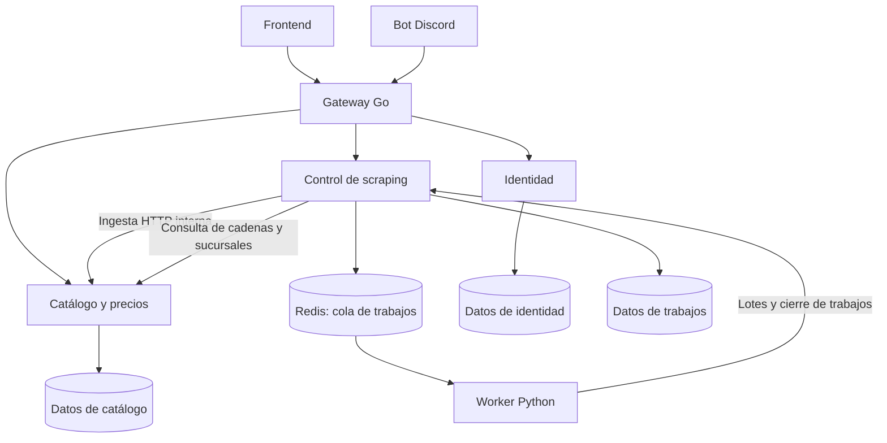

# Refactorización del backend: arquitectura final y etapas

**Estado:** propuesta técnica; la extracción de servicios todavía no se ha implementado.
**Base revisada:** `develop`, commit `5db3d25`.
**Integración:** `develop-refactor`.
**Responsable:** `vmatus`, con implementación asistida y revisión del equipo.

## 1. Objetivo de la refactorización

Separar las responsabilidades de la API Go para que catálogo, identidad y coordinación de scraping tengan ejecutables, imágenes y despliegues independientes. Conservar las rutas públicas y el comportamiento que utilizan el frontend, el bot y el worker.

Actualmente, el mismo proceso registra autenticación, productos, administración y scraping, y construye sus repositorios con una conexión común a PostgreSQL. El HPA replica ese proceso completo. Las carpetas `handlers`, `services` y `repositories` separan capas dentro del mismo ejecutable.

El resultado esperado es que aumentar la carga de consultas a productos permita escalar catálogo sin replicar también la implementación de login y coordinación de scraping. La entrada y PostgreSQL pueden seguir recibiendo carga: el desacoplamiento no elimina sus límites ni garantiza que ningún otro componente necesite escalar.

## 2. Cómo quedará el backend al terminar

```text
backend/
├── api/                       # Gateway Go; conserva el punto de entrada actual
│   ├── cmd/gateway/main.go
│   ├── internal/config/
│   ├── internal/proxy/
│   ├── internal/middleware/
│   ├── go.mod
│   ├── go.sum
│   └── Dockerfile
├── catalogo/                  # Productos, precios, búsquedas y persistencia de ingesta
│   ├── cmd/catalogo/main.go
│   ├── internal/
│   │   ├── handlers/
│   │   ├── services/
│   │   ├── repositories/
│   │   ├── domain/
│   │   ├── infrastructure/
│   │   ├── middleware/
│   │   └── config/
│   ├── tests/
│   ├── go.mod
│   ├── go.sum
│   └── Dockerfile
├── identidad/                 # Usuarios, perfiles, autenticación y emisión de JWT
│   └── ...                    # Ejecutable, capas, pruebas y módulo Go propios
├── scraping_control/          # Trabajos, estados, cola y recepción de resultados
│   └── ...                    # Ejecutable, capas, pruebas y módulo Go propios
├── scraper/                   # Worker Python existente y spiders
├── bot_discord/               # Cliente de la API pública
├── ia_conversacional/          # Prototipo existente; fuera de esta extracción inicial
└── motor_rutas/                # Prototipo existente; fuera de esta extracción inicial
```

Cada servicio Go tendrá su propio módulo y sus propias dependencias. Ningún servicio importará los repositorios, modelos GORM o lógica de negocio de otro. Los contratos HTTP se documentarán con ejemplos y pruebas de compatibilidad; una biblioteca compartida no debe volver a unir todos los dominios.

Se mantiene `backend/api` como Gateway Go para aprovechar la entrada existente. El Ingress Nginx del clúster enviará las solicitudes a esa Gateway. Si posteriormente el equipo decide usar solo Nginx para enrutar, podrá sustituirla sin cambiar los contratos de los servicios; no forma parte del primer refactor.



Los tres grupos de datos pueden residir en el mismo servidor PostgreSQL. Representan propiedad y permisos separados, no tres servidores nuevos obligatorios.

### Responsabilidad de cada componente

| Componente | Hace | Límites |
|---|---|---|
| Gateway | Enruta, aplica CORS y políticas comunes, propaga solicitudes y errores | Sin PostgreSQL, repositorios ni reglas de catálogo, usuarios o trabajos |
| Identidad | Registro, login local/Google, perfiles, JWT y datos de usuarios | No consulta productos ni controla scraping |
| Catálogo | Listado, búsqueda, detalle, precios, administración de productos e ingesta | No firma tokens ni gestiona estados de trabajos |
| Control de scraping | Crea, consulta, encola y finaliza trabajos; valida su contexto antes de enviar lotes | No escribe directamente productos o precios |
| Worker Python | Consume trabajos, ejecuta spiders, normaliza resultados y los envía | No depende de acceso directo a PostgreSQL |

### Rutas públicas compatibles

| Ruta existente | Servicio que la atiende detrás de la Gateway |
|---|---|
| `/api/v1/auth/*` | Identidad |
| `/api/v1/productos` y `/api/v1/productos/*` | Catálogo |
| `/api/v1/admin/productos` y sus variantes existentes | Catálogo, con autorización administrativa |
| `/api/v1/scraper/trabajos*` | Control de scraping |
| `/api/v1/scraper/productos` | Control de scraping, que delega la persistencia en catálogo |
| `/api/v1/scraper/trabajos/:id/productos` | Control de scraping, que valida el trabajo y delega la persistencia |

El proxy debe conservar métodos, path, query, cuerpo, códigos HTTP, cookies y headers pertinentes. Tendrá timeouts, propagación de cancelación y respuestas definidas cuando un servicio no esté disponible. No hará reintentos automáticos de escrituras sin garantía de idempotencia.

Los endpoints internos de ingesta y resolución de cadenas/sucursales de catálogo tendrán un contrato propio; no se expondrán simplemente por publicar todas las rutas del servicio. Los servicios verificarán autorización donde corresponda y las llamadas internas tendrán autenticación. No se confiará en headers de usuario enviados arbitrariamente por clientes.

## 3. Datos y autenticación durante la transición

La extracción inicial conservará tablas y formatos actuales para reducir cambios simultáneos. Esto permite separar procesos antes de completar la separación de datos.

| Propietario final | Datos actuales relacionados |
|---|---|
| Identidad | `api.usuarios` y datos de perfil que use el servicio |
| Catálogo | `scraper.productos_crudos`, `scraper.capturas_precios`, cadenas y sucursales; catálogo normalizado según los flujos existentes |
| Control de scraping | `scraper.trabajos_scraper` |
| Módulos fuera del alcance | Tablas de rutas, recetas y otras funciones todavía no extraídas |

En la etapa final se definirán usuarios PostgreSQL con permisos por propietario y migraciones por dominio. Los nombres actuales de los esquemas no obligan a que todo `scraper.*` pertenezca a control de scraping. No se moverán tablas únicamente para cambiarles el nombre.

Hay dependencias concretas que deben revisarse: `trabajos_scraper` referencia cadenas y usuarios; las tablas de rutas referencian usuarios, productos, sucursales y capturas. Las claves foráneas entre propietarios se retirarán o sustituirán únicamente con una estrategia de validación, consistencia y borrado que preserve los datos. Las dependencias de módulos fuera del alcance se documentarán como limitaciones; no se afirmará desacoplamiento de toda la plataforma mientras existan.

Se conservarán inicialmente JWT HS256 y las cookies actuales para evitar romper sesiones durante la extracción. Identidad emitirá los tokens y los servicios protegidos verificarán firma, algoritmo, vigencia y rol con configuración segura. Compartir un secreto HS256 permite técnicamente firmar tokens a cualquier proceso que lo posea; separar firma y verificación con claves asimétricas puede ser una mejora posterior y no se presentará como ya resuelta por mover el código.

## 4. Etapas y tareas Scrum centradas en refactorizar

Las pruebas, métricas, documentación y cambios de infraestructura forman parte de terminar cada extracción. No se contabilizan como servicios adicionales ni se deja la validación para el final.

### RF-01 — Extraer catálogo y precios de la API central

**Objetivo:** convertir las consultas de productos en un servicio independiente.

**Cambios concretos:**
- Crear `backend/catalogo` con configuración, ejecutable y módulo Go propios.
- Mover `producto_handler`, `producto_service`, `producto_repository` y solo sus DTO/modelos necesarios.
- Extraer las rutas públicas y administrativas de productos, conservando su autorización.
- Hacer que la API existente envíe esas rutas al nuevo servicio y mantenga temporalmente identidad y scraping.
- Incorporar imagen, Compose y manifiestos de catálogo con recursos, probes y HPA propios; adaptar CI para la rama de integración.

**Termina cuando:** las pruebas existentes relevantes y las solicitudes funcionales pasan a través de la entrada pública, el frontend mantiene sus contratos y catálogo puede arrancar/desplegarse por separado. Registrar los fallos previos antes de mover código. Validar escalado en el clúster de prueba cuando esté disponible.

**Transición pendiente:** la ingesta sigue escribiendo desde la API antigua; todavía hay acceso compartido a tablas de productos.

**Rama sugerida:** `backend/refactor/extraer-catalogo-vmatus`.

### RF-02 — Extraer identidad y gestión de usuarios

**Objetivo:** independizar registro, login y perfiles.

**Cambios concretos:**
- Crear `backend/identidad` y mover handlers, servicio y repositorio de usuarios.
- Trasladar generación de JWT, login Google y reglas de perfil.
- Enrutar `/api/v1/auth/*` hacia identidad.
- Mantener rate limiting de login, cookies y validación de roles en los servicios que la necesitan.
- Incorporar imagen, Compose, configuración y Deployment propios.

**Termina cuando:** registro, login, perfil y administración conservan su comportamiento; pasan pruebas de JWT/RBAC y regresión de catálogo; cambiar o desplegar identidad no exige recompilar catálogo.

**Rama sugerida:** `backend/refactor/extraer-identidad-vmatus`.

### RF-03 — Separar persistencia de ingesta y propiedad de catálogo

**Objetivo:** concentrar las escrituras de productos/precios en catálogo.

**Cambios concretos:**
- Extraer de `scraper_service` la validación del lote relativa al catálogo y de `scraper_repository` la persistencia de productos y capturas.
- Crear un contrato HTTP interno de ingesta y un cliente en el coordinador actual.
- Conservar en el coordinador la validación del trabajo y sus estados.
- Encapsular resolución de cadenas/sucursales en catálogo mediante contrato, evitando nuevas consultas cruzadas.
- Definir claves de idempotencia para que reenviar un mismo lote no duplique capturas; acordar qué identifica una observación nueva.

**Termina cuando:** catálogo es el único escritor de esos datos en los flujos refactorizados; las respuestas externas de ingesta siguen siendo compatibles; reenvíos, timeouts y fallos parciales tienen resultados probados. Comprobar concurrencia y pool de conexiones según número de réplicas.

**Rama sugerida:** `backend/refactor/separar-ingesta-vmatus`.

### RF-04 — Extraer control de scraping

**Objetivo:** independizar trabajos, estados y coordinación del worker.

**Cambios concretos:**
- Crear `backend/scraping_control` y mover endpoints de trabajos, lógica de estados y repositorio de trabajos.
- Mover el encolado Redis y los adaptadores que envían lotes a catálogo.
- Mantener las URLs públicas usadas por bot y worker mediante la Gateway.
- Incorporar imagen, Compose y Deployment propios.
- Revisar entrega y recuperación de trabajos: el `BRPOP` actual retira mensajes al consumirlos; no asumir entrega fiable bajo caídas sin probarla.

**Termina cuando:** una prueba con extracción simulada recorre creación → cola → worker → ingesta → consulta de precios → cierre. Bot y worker siguen funcionando; un fallo de catálogo no marca falsamente una ingesta como completada. Registrar si la recuperación de la cola requiere un incremento adicional.

**Rama sugerida:** `backend/refactor/extraer-control-scraping-vmatus`.

### RF-05 — Convertir la API central en Gateway y cerrar límites de datos

**Objetivo:** quitar de la API toda la lógica ya extraída.

**Cambios concretos:**
- Reorganizar `backend/api` para conservar únicamente proxy, configuración, políticas comunes y salud de la entrada.
- Eliminar su inicialización de PostgreSQL, repositorios de negocio, modelos GORM y dependencias que ya no necesite.
- Configurar destinos por variables `IDENTIDAD_URL`, `CATALOGO_URL` y `SCRAPING_URL`.
- Asignar credenciales y permisos PostgreSQL por dominio; completar migraciones y contratos para los accesos cruzados de los tres servicios.
- Separar liveness de readiness; la salud global puede mostrar dependencias sin volver indisponible toda la entrada cuando falla un único servicio.

**Termina cuando:** la Gateway arranca sin `DB_URL`, los servicios se ejecutan con permisos propios y no acceden a tablas privadas de otros servicios extraídos. Quitar un backend produce errores definidos solo en las rutas afectadas, salvo dependencias funcionales explícitas. Las migraciones conservan los datos y tienen estrategia de recuperación validada.

**Rama sugerida:** `backend/refactor/convertir-api-gateway-vmatus`.

### RF-06 — Consolidar el backend desacoplado para integración

**Objetivo:** entregar la arquitectura completa lista para revisión del equipo.

**Cambios concretos:**
- Completar Compose y Kubernetes con configuraciones coherentes, imágenes identificadas por commit y despliegue por servicio.
- Ajustar HPA, recursos y conexiones según la carga medida y las cuotas del clúster.
- Retirar configuración obsoleta y actualizar diagramas, contratos e instrucciones de arranque.
- Ejecutar regresión conjunta, pruebas de carga por dominio y ensayo de rollback.

**Termina cuando:** local y el entorno de prueba del clúster usan los mismos límites de servicios; catálogo puede escalar sin replicar identidad/control de scraping por compartir ejecutable; se documentan carga, errores, p95, conexiones y comportamiento de réplicas. Los objetivos de rendimiento se acuerdan a partir de la medición inicial y recursos disponibles.

**Rama sugerida:** `backend/refactor/consolidar-microservicios-vmatus`.
**Salida:** PR de `develop-refactor` hacia `develop`, con aprobación del equipo. Publicación en producción es un paso posterior.

## 5. Orden y entregables parciales

```text
RF-01 Catálogo
    ↓
RF-02 Identidad
    ↓
RF-03 Ingesta en catálogo
    ↓
RF-04 Control de scraping
    ↓
RF-05 Gateway y límites de datos
    ↓
RF-06 Consolidación e integración
```

Después de RF-01 ya habrá un resultado utilizable: consultas de catálogo desplegadas de forma independiente. Después de RF-04 las responsabilidades activas estarán separadas en procesos; RF-05 cierra la dependencia de la antigua API y los accesos a datos entre esos dominios.

Una etapa puede tener varios PR si sus cambios son grandes. Cada PR debe dejar una versión ejecutable; no mantener una rama de extracción durante meses sin integraciones revisables.

## 6. Flujo de ramas y PR

1. Partir de la última `develop-refactor` para cada rama de trabajo.
2. Usar `[área]/[tipo]/[tarea]-vmatus`, conforme a `GUIA_GITFLOW_Y_PR.md`.
3. Abrir PR hacia `develop-refactor` con cambios, validación, transición pendiente y rollback.
4. Obtener revisión del equipo, resolver conversaciones y usar Squash and merge.
5. Actualizar la base antes de la siguiente extracción.
6. Integrar `develop-refactor` a `develop` cuando RF-06 esté aceptada.

`develop-refactor` y el destino temporal de los PR son las excepciones solicitadas por el usuario al flujo habitual. No se harán cambios directamente en `main` ni en `develop`.

## 7. Registro de cada tarea

```markdown
Título: RF-XX — [extracción o transformación]
Objetivo:
Responsable: vmatus
Estado: pendiente / en progreso / revisión / bloqueada / terminada
Rama:
PR y commit integrado:
Cambios implementados:
Criterios de aceptación:
Pruebas y evidencia:
Transición o limitaciones pendientes:
Estimación de tiempo humano:
Tiempo humano real: guía + revisión + pruebas + documentación
Bloqueos:
```

Con 5 horas semanales del responsable y ejecución asistida, la planificación se ajustará después de cada extracción. Las estimaciones previas de 140–220 horas-persona eran de ejecución humana del trabajo completo; no deben registrarse como horas realizadas ni convertirse automáticamente en tiempo humano de supervisión del asistente.

## 8. Alcance y prerrequisitos

La refactorización incluye los dominios activos de la API Go. No incluye implementar funciones nuevas de IA/rutas, conectarlas al catálogo, introducir Kafka ni crear servidores PostgreSQL separados. Su código existente se conserva y sus límites pendientes se documentan.

Antes de validar cada extracción se resolverán los bloqueos del entorno: descarga de Go por `storage.googleapis.com` si continúa denegada y acceso a `api.github.com` para crear PR. Guardar dominios en el borrador no prueba que estén activos. La validación del clúster requiere un entorno de prueba y sus permisos; mientras falten, se reportará validación local sin afirmar que el escalado del clúster fue probado.
