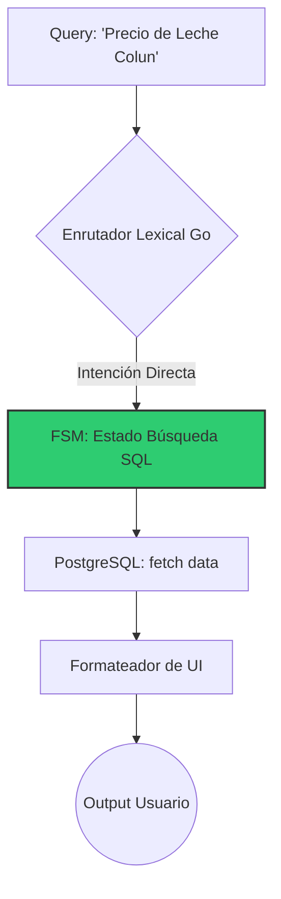
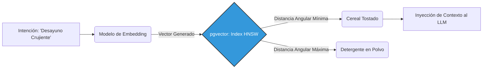

# Propuesta Arquitectónica: Modelo Híbrido de Inteligencia Artificial y Estrategias de Validación

**Autores:** Vicente Matus, Daniela Romero, Renato Carrasco, Fabian Sánchez, Esban Vejar
**Profesor:** Marcelo Matamala
**Fecha:** Septiembre 2026
**Documento Previo Requerido:** `01_Pre_Entendimiento_Alucinaciones.md`

---

## 1. Introducción al Documento

Una vez resuelto el marco teórico de las alucinaciones probabilísticas, el presente informe eleva el análisis hacia la ingeniería de software aplicada. El objetivo es estructurar una topología de flujo de datos capaz de aislar el modelo de lenguaje de operaciones deterministas, minimizando el consumo de tokens y anulando el riesgo de generación de información espuria.

## 2. Topología del Enrutamiento Asimétrico (Solución Principal)

La solución propuesta por el equipo de desarrollo se denomina **Arquitectura Híbrida de Enrutamiento Asimétrico**. Este diseño abandona el paradigma clásico de "chat directo con el LLM" en favor de un sistema de capas supervisadas por un microservicio en Go.

### 2.1. Nivel Cero: Clasificación de Intenciones (Intent Routing)
Antes de ejecutar cualquier lógica, un enrutador (NLU heurístico basado en Regex y análisis léxico rápido) clasifica la intención del usuario. Si la varianza semántica es baja (ej. "¿Cuánto cuesta el kilo de pan?"), el enrutador bloquea el acceso a la IA y desvía la petición a la Capa 1.

### 2.2. Capa 1: Máquina de Estados Finitos (El "Call Center")
Actúa como un agente conversacional determinista y estructurado. 

*   **Ingeniería:** Mantiene el contexto a través de un árbol de decisiones estricto (Máquina de Estados). Traduce intenciones simples directamente a consultas SQL (`SELECT precio FROM productos WHERE nombre ILIKE...`).
*   **Eficiencia:** El tiempo de respuesta es sub-100 milisegundos. El consumo económico es nulo (0 tokens) y el índice de facticidad es 100%, ya que la información es un volcado crudo de PostgreSQL a la interfaz.

### 2.3. Capa 2: Motor de RAG Restrictivo (LLM On-Demand)
Reservada exclusivamente para intenciones de alta entropía (ej. *"Arma un menú semanal vegano para 2 personas por $30.000 usando productos del Jumbo"*).

*   **Ingeniería de Contexto:** El backend en Go ejecuta consultas complejas para recolectar el catálogo aplicable. Luego, aplica un algoritmo de *Chunking* (segmentación) para evitar desbordar el *Context Window Limit* del LLM.
*   **Prompt Injection:** Se empaqueta el catálogo filtrado en formato JSON inyectado bajo un *System Prompt* coercitivo. Un Post-Procesador en Go audita la respuesta de la IA; si detecta una entidad (producto/precio) que no estaba en el JSON original, la respuesta es silenciada por considerarse alucinada.

## 3. Evaluación Crítica del Estado del Arte (Alternativas Analizadas)

Para fundamentar la decisión de la arquitectura híbrida, se sometieron a análisis de viabilidad técnica las siguientes estrategias emergentes:

### 3.1. Auto-Corrección y Cadena de Verificación (Chain-of-Verification / Reflexion)
*   **Mecánica:** Consiste en forzar al LLM a generar un borrador (Draft), y luego inyectar ese borrador en un segundo prompt pidiendo: *"Analiza críticamente tu respuesta paso a paso y verifica si inventaste algún producto"*.
*   **Evaluación:** **Descartada**. Si bien reduce alucinaciones en tareas de razonamiento lógico, en comercio electrónico duplica la latencia (TTFT - Time To First Token) y los costos de facturación por usuario sin garantizar inmunidad factual.

### 3.2. Adaptación de Pesos (PEFT / LoRA Fine-Tuning)
*   **Mecánica:** Entrenar una red neuronal de código abierto adaptando sus matrices de peso (Low-Rank Adaptation) para que "aprenda de memoria" nuestro catálogo.
*   **Evaluación:** **Descartada**. Las bases de datos de supermercados sufren mutaciones de estado diario (fluctuaciones de precio y quiebres de stock). La memoria paramétrica de un LLM es inmutable una vez entrenado; requeriría re-entrenamiento diario, lo cual es inviable financieramente.

### 3.3. Graph RAG (Grafos de Conocimiento)
*   **Mecánica:** Utilizar bases de datos orientadas a grafos (como Neo4j) para mapear explícitamente relaciones del tipo `(Producto_A)-[SE_VENDE_EN]->(Supermercado_B)-[CUESTA]->(Precio_X)`. Al consultar al LLM, se extrae un sub-grafo relacional perfecto.
*   **Evaluación:** Altamente precisa y convergente con investigaciones algorítmicas pasadas del proyecto. Sin embargo, mantener sincronizada una base de datos de grafos con la base de datos transaccional (PostgreSQL) añade una sobrecarga arquitectónica que no se justifica para la fase actual.

## 4. Recomendación Técnica Autónoma: Búsqueda Híbrida (Vectorial + Léxica)

Si bien la arquitectura asimétrica propuesta (Capa 1 + Capa 2) es robusta, el puente de datos hacia la Capa 2 presenta una deficiencia: la búsqueda SQL es léxica (coincidencia de caracteres). Si el usuario solicita *"ingredientes para algo crujiente de desayuno"*, el motor SQL tradicional no retornará *"cereal"*, privando al LLM del contexto necesario para generar la receta.

> 💡 **Recomendación Estratégica:** Aumentar la infraestructura instalando la extensión `pgvector` en PostgreSQL, habilitando una **Búsqueda Híbrida (BM25 + Semantic Cosine Similarity)**.

### 4.1. Mecánica de los Embeddings (Espacios de Alta Dimensionalidad)
Mediante un modelo de *embeddings* (ej. `text-embedding-3`), el catálogo se transforma en vectores numéricos continuos. 
El concepto de "Cereal" podría ocupar las coordenadas `[0.82, -0.15, 0.44]`. Cuando el usuario busca "Crujiente de desayuno", esta frase se vectoriza ocupando una coordenada casi idéntica `[0.80, -0.10, 0.41]`. 

### 4.2. Indexación y Algoritmia de Recuperación
Al aplicar la fórmula matemática de **Similitud del Coseno** en PostgreSQL, la base de datos medirá la distancia angular entre los vectores, retornando inmediatamente los productos conceptualmente afines, sin importar si comparten o no las mismas letras en su nombre.

### 4.3. Conclusión
La implementación de `pgvector` con indexación **HNSW** (Hierarchical Navigable Small World) permite búsquedas semánticas sub-milisegundo a gran escala. Esto asegura que la Capa 2 del modelo híbrido reciba siempre el catálogo exacto, cerrando definitivamente las brechas probabilísticas de alucinación y dotando al sistema de una inteligencia de recuperación de nivel corporativo.
