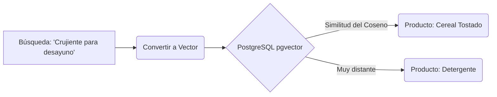

# Propuesta Arquitectónica: Modelo Híbrido de Inteligencia Artificial y Estrategias de Validación

**Autores:** Vicente Matus, Daniela Romero, Renato Carrasco, Fabian Sánchez, Esban Vejar
**Profesor:** Marcelo Matamala
**Fecha:** Septiembre 2026
**Documento Previo Requerido:** `01_Pre_Entendimiento_Alucinaciones.md`

---

## 1. Introducción al Documento

Una vez establecido por qué los Modelos de Lenguaje (LLMs) sufren de sesgos y alucinaciones, el presente reporte detalla la solución de ingeniería propuesta para la plataforma. El objetivo es estructurar un flujo de datos que reduzca radicalmente los costos de API (tokens) y garantice que el 100% de la información mostrada provenga del catálogo sincronizado.

---

## 2. Solución Arquitectónica Principal: Enrutamiento Asimétrico

La propuesta del equipo se basa en una **Arquitectura Híbrida de dos capas** (coloquialmente referida como modelo "Call Center"). Esta arquitectura intercepta la petición del usuario antes de que toque la IA.

### 2.1. Capa 1: Bot Heurístico (Máquina de Estados Finitos - FSM)

La primera línea defensiva es un bot determinista programado en Go. Funciona evaluando la intención del usuario a través de menús estructurados o clasificación por palabras clave.

```mermaid
graph TD
    A[Usuario escribe: "Precio de Leche Colun"] --> B{Capa 1: Enrutador Heurístico}
    B -- Detección de Búsqueda Directa --> C[Backend ejecuta SQL LIKE en BD]
    C --> D[Retorna Lista de Precios Formateada]
    D --> E[Fin de interacción. Gasto tokens: 0]
```

*   **Ventajas:** Si el usuario solo quiere comparar un producto específico, la Capa 1 lo resuelve con consultas de base de datos tradicionales. El margen de alucinación es matemáticamente 0% y el costo es nulo.

### 2.2. Capa 2: LLM bajo Demanda (RAG Restrictivo)

El modelo de lenguaje solo se invoca si la intención del usuario es analítica o requiere síntesis cruzada (ej. *"Arma una receta vegana con un presupuesto de $10.000"*).

```mermaid
graph TD
    A[Usuario: "Receta vegana por $10.000"] --> B{Capa 1: Enrutador Heurístico}
    B -- Detección Analítica (Receta) --> C[Backend Go busca productos veganos < $10.000 en SQL]
    C --> D[Go inyecta productos en JSON al Prompt del LLM]
    D --> E[LLM redacta receta SOLO con esos ingredientes]
    E --> F[Retorno al usuario]
```

*   **Mecánica de Anclaje:** El backend obliga al modelo a generar la respuesta encerrándolo en un contexto cerrado. Si el LLM intenta sugerir "Champiñones" (porque su memoria paramétrica lo asocia a dietas veganas), pero no venían en el JSON, un *post-procesador* en Go interceptará la respuesta, validará las entidades y bloqueará el mensaje por alucinación.

---

## 3. Alternativas del Estado del Arte Evaluadas

Para demostrar el rigor técnico de la propuesta, se evaluaron otras alternativas que fueron descartadas por viabilidad técnica o financiera en la etapa actual:

*   **Auto-Corrección Asistida (Reflexion):** Obligar a la IA a auditar su propia respuesta en una segunda llamada a la API ("¿Hay algún producto inventado en tu respuesta anterior?"). *Descartada temporalmente porque duplica los costos de facturación por usuario.*
*   **Fine-Tuning de Modelos Locales:** Entrenar una red neuronal (ej. Llama 3) inyectando los pesos de nuestro catálogo. *Descartada porque los precios cambian a diario, y reentrenar un modelo 24/7 requiere poder computacional inasumible.*

---

## 4. Recomendación Técnica Autónoma: Búsqueda Vectorial (`pgvector`)

Si bien la propuesta de las dos capas (Call Center + LLM) es excelente, existe un cuello de botella en la Capa 2: **¿Cómo el backend en Go sabe qué productos inyectarle al LLM cuando el usuario hace consultas ambiguas?** 

Una consulta SQL clásica (`WHERE nombre LIKE '%dulce%'`) fallará miserablemente si el usuario pide *"algo crujiente para el desayuno"*.

> 💡 **Recomendación Estratégica:** Complementar la Capa 2 integrando **Bases de Datos Vectoriales** (extensión `pgvector` para PostgreSQL).

### 4.1. Concepto y Ejemplo de Embeddings Vectoriales
Las bases de datos vectoriales no guardan palabras, guardan "significados" representados por coordenadas matemáticas en un espacio de miles de dimensiones (Embeddings). 

*   **El proceso:** Cuando cargamos nuestro catálogo, un modelo convierte las descripciones en vectores. "Cereal Tostado" podría ser el vector `[0.8, -0.2, 0.5]`.
*   **Búsqueda Semántica:** Si el usuario busca *"algo crujiente para el desayuno"*, eso se convierte en el vector `[0.7, -0.1, 0.4]`.
*   **La Similitud del Coseno:** PostgreSQL utiliza matemáticas (Similitud del Coseno) para medir la distancia geométrica entre vectores. Descubrirá que el vector de la búsqueda está extremadamente cerca de "Cereal", y muy lejos de "Detergente" `[-0.9, 0.8, -0.1]`.



**Conclusión final:** Al usar `pgvector`, el backend siempre sabrá qué productos exactos entregarle a la IA (incluso con peticiones ambiguas), cerrando el círculo de la arquitectura híbrida y construyendo un asistente de compras de nivel corporativo.
